# SKonnect Database ERD

Source: `prisma/schema.prisma`

This diagram reflects the Prisma schema currently used to generate the database client. Solid relationships are declared Prisma relations. Dashed relationships are logical references represented by an ID column but not declared as Prisma relations.

```mermaid
erDiagram
    USER {
        uuid id PK
        uuid authId UK
        string email UK
        string username UK
        string fullName
        string phoneNumber
        string avatarUrl
        enum role
        enum languagePref
        json settings
        boolean mustSecureAccount
        boolean usesTemporaryPassword
        uuid kkProfileId FK,UK
        string barangay
        boolean isActive
        boolean hasSeenOnboarding
        datetime createdAt
        datetime updatedAt
    }

    KK_PROFILE {
        uuid id PK
        string firstName
        string middleName
        string lastName
        string fullName
        string purok
        string addressLine
        string barangay
        datetime birthDate
        string contactNumber
        string email UK
        boolean isVerified
        datetime createdAt
        datetime updatedAt
    }

    GRANTEE {
        uuid id PK
        uuid userId FK,UK
        enum status
        string yearLevel
        string school
        float generalAverage
        datetime dateEnrolled
        datetime dateRemoved
        string remarks
        datetime createdAt
        datetime updatedAt
    }

    SUBMISSION {
        uuid id PK
        uuid granteeId FK
        string semester
        string gradeFileUrl
        string coeFileUrl
        json gradeRows
        float generalAverage
        enum status
        uuid reviewedById
        string reviewNotes
        string[] flaggedFields
        enum coeStatus
        enum gradesStatus
        datetime submittedAt
        datetime reviewedAt
        datetime coeSubmittedAt
        datetime coeApprovedAt
        datetime gradesSubmittedAt
        datetime gradesApprovedAt
    }

    SKEAP_APPLICATION {
        uuid id PK
        uuid userId FK
        string currentCourse
        string yearLevel
        float gwa
        json grades
        json timeline
        string enrollmentFileUrl
        string reportCardFileUrl
        enum status
        int waitlistPosition
        string applicantName
        string permanentAddress
        datetime dateOfBirth
        string school
        datetime submittedAt
        datetime updatedAt
    }

    SYSTEM_SETTING {
        string id PK
        string key UK
        int value
        datetime updatedAt
    }

    EVENT {
        uuid id PK
        string title
        string description
        string venue
        datetime eventDate
        int maxSlots
        int filledSlots
        string imageUrl
        enum status
        boolean isKatipunan
        string payoutSchedule
        uuid createdById FK
        boolean allowNonPico
        int minPicoMembers
        int nonPicoLimit
        enum allowedType
        datetime createdAt
        datetime updatedAt
    }

    REGISTRATION {
        uuid id PK
        uuid eventId FK
        uuid userId FK
        datetime registeredAt
        string address
        int age
        string contactNumber
        string email
        string fullName
        string sex
    }

    PROFILING_REGISTRATION {
        uuid id PK
        uuid userId FK
        string program
        string fullName
        string address
        string sex
        int age
        datetime birthDate
        string email
        string facebook
        string contactNumber
        string civilStatus
        string youthClassification
        string youthAgeGroup
        string workStatus
        string educationalBackground
        string registeredSKVoter
        string votedLastSK
        string registeredNationalVoter
        string attendedKKAssembly
        string assemblyTimes
        string noAssemblyReason
        boolean consent
        datetime submittedAt
        string reviewStatus
        string reviewNotes
        string idDocumentType
        string idFrontFileUrl
        string idBackFileUrl
        string idSingleFileUrl
    }

    ANNOUNCEMENT {
        uuid id PK
        uuid authorId FK
        string title
        string content
        boolean isPublished
        datetime publishedAt
        string imageUrl
        datetime createdAt
        datetime updatedAt
    }

    INQUIRY {
        uuid id PK
        uuid userId FK
        uuid applicationId FK,UK
        string subject
        string message
        enum language
        boolean isResolved
        string response
        datetime respondedAt
        json reviewThread
        string lastUpdatedBy
        datetime resubmittedAt
        string reviewStatus
        datetime createdAt
    }

    NOTIFICATION_LOG {
        uuid id PK
        uuid userId
        string type
        string channel
        string subject
        datetime sentAt
        boolean success
    }

    NOTIFICATION {
        uuid id PK
        uuid userId FK
        string sourceKey
        boolean isRead
        datetime readAt
        datetime createdAt
    }

    GRANTEE_MESSAGE {
        uuid id PK
        uuid userId FK
        uuid senderId FK
        string subject
        string body
        datetime createdAt
    }

    REMINDER_SETTING {
        uuid id PK
        enum type UK
        int[] offsets
        datetime deadline
        boolean active
        datetime createdAt
        datetime updatedAt
    }

    REMINDER_LOG {
        uuid id PK
        uuid userId FK
        enum reminderType
        string targetType
        uuid targetId
        datetime triggerDate
        string channel
        datetime sentAt
        boolean success
        json metadata
    }

    AUDIT_LOG {
        uuid id PK
        uuid actorId FK
        string action
        string targetTable
        uuid targetId
        json beforeData
        json afterData
        datetime createdAt
        datetime recorded
        json metadata
        json meta
    }

    CHAT_EMBEDDING {
        uuid id PK
        string content
        enum language
        string sourceType
        vector embedding
        datetime createdAt
    }

    CHAT_LOG {
        uuid id PK
        uuid userId
        string question
        enum detectedLanguage
        string answer
        boolean wasEscalated
        datetime createdAt
    }

    CHAT_MESSAGE {
        uuid id PK
        uuid userId FK
        enum role
        string content
        enum language
        datetime createdAt
    }

    ADMIN_SETTINGS {
        string key PK
        int totalBudget
    }

    SEMESTER {
        uuid id PK
        string name
        boolean isCurrent
    }

    ACCOUNTING_PAYOUT {
        uuid id PK
        uuid granteeId UK
        int amount
        string semester
        datetime claimedAt
        datetime createdAt
    }

    USER ||--o| KK_PROFILE : "has profile"
    USER ||--o| GRANTEE : "becomes"
    GRANTEE ||--o{ SUBMISSION : "uploads"
    USER ||--o{ SKEAP_APPLICATION : submits
    SKEAP_APPLICATION ||--o| INQUIRY : "may have"

    USER ||--o{ EVENT : creates
    EVENT ||--o{ REGISTRATION : has
    USER ||--o{ REGISTRATION : makes

    USER o|--o{ PROFILING_REGISTRATION : submits
    USER ||--o{ ANNOUNCEMENT : authors
    USER ||--o{ INQUIRY : opens
    USER ||--o{ NOTIFICATION : receives
    USER ||--o{ GRANTEE_MESSAGE : receives
    USER o|--o{ GRANTEE_MESSAGE : sends
    USER ||--o{ REMINDER_LOG : receives
    USER ||--o{ AUDIT_LOG : performs
    USER ||--o{ CHAT_MESSAGE : sends

    GRANTEE o|..|| ACCOUNTING_PAYOUT : "logical reference"
    USER o|..o{ NOTIFICATION_LOG : "userId reference"
    USER o|..o{ CHAT_LOG : "userId reference"
    USER o|..o{ SUBMISSION : "reviewedById reference"
```

## Enumerations

- `Role`: `YOUTH`, `GRANTEE`, `SK_OFFICIAL`, `SUPER_ADMIN`
- `GranteeStatus`: `ACTIVE`, `PROBATIONARY`, `GRADUATED`, `REMOVED`
- `EventStatus`: `UPCOMING`, `REGISTRATION_OPEN`, `REGISTRATION_CLOSED`, `COMPLETED`
- `SubmissionStatus`: `PENDING`, `APPROVED`, `REJECTED`, `WAITLISTED`, `RETURNED_FOR_EDIT`
- `Language`: `ENGLISH`, `FILIPINO`, `ILOCANO`
- `ChatMessageRole`: `USER`, `ASSISTANT`
- `EventAllowedType`: `SOLO_ONLY`, `GROUP_ONLY`, `BOTH`
- `ReminderType`: `SKEAP_APPLICATION`, `EVENT_REGISTRATION`

## Schema Notes

- `User.kkProfileId` is the physical foreign key for the one-to-one `User` to `KKProfile` relationship.
- `NotificationLog.userId`, `ChatLog.userId`, `Submission.reviewedById`, and `AccountingPayout.granteeId` are stored IDs without Prisma relation declarations in the current schema.
- `Semester`, `SystemSetting`, `AdminSettings`, and `ChatEmbedding` currently have no declared relations to other models.
- Table names use the Prisma `@@map` names, such as `users`, `grantees`, and `skeap_applications`.
