# SKonnect Use Case Diagram Specification

Source basis: `prisma/schema.prisma`, `app/api/**/route.ts`, `app/**/page.tsx`, `lib/auth.ts`, and `proxy.ts`.

The active Prisma configuration points to `prisma/schema.prisma`. The root-level `schema.prisma` is a divergent alternate schema and should be reconciled before being used as the runtime source.

## 1. Actors and Hierarchy

### Primary actors

| Actor | Evidence and access |
|---|---|
| **Youth Resident** | `Role.YOUTH`; default application role. Uses the public/youth portal, KK Profiling, SKEAP applications, inquiries, events, notifications, and chatbot support. |
| **SKEAP Grantee** | `Role.GRANTEE` with a related `Grantee` record. Inherits youth capabilities and adds the grantee dashboard, compliance submissions, document tracking, and payout views. |
| **SK Official** | `Role.SK_OFFICIAL`; accesses the SK Official Admin Workspace. |
| **Super Admin** | `Role.SUPER_ADMIN`; accesses the Super Admin Workspace and is permitted in most SK Official administration APIs. |
| **Anonymous Visitor** | Unauthenticated visitor who can view public information and use the anonymous chatbot flow. |

### Secondary actors and external systems

| Actor | Responsibility |
|---|---|
| **Supabase Auth** | Account creation, authentication, session validation, signout, and password security. |
| **Supabase Storage** | Stores IDs, residency certificates, SKEAP documents, grantee submissions, avatars, and announcement media. |
| **OCR Worker** | Validates IDs and residency documents and checks names and birthdates. |
| **RAG Chatbot / Knowledge Service** | Generates multilingual chatbot answers from the knowledge base. |
| **Email Service / SMTP** | Sends broadcasts, reminders, announcements, and status notifications. |
| **Reminder Scheduler** | Triggers deadline and status reminders. |
| **Prisma/PostgreSQL** | Persists users, profiles, applications, submissions, inquiries, notifications, settings, and audit records. |

### Generalization

Conceptually:

```text
Authenticated User
├── Youth Resident
│   └── SKEAP Grantee
├── SK Official
└── Super Admin
```

The Grantee transition is implemented as a role change from `YOUTH` to `GRANTEE`, followed by creation or activation of a `Grantee` record. It is not a database inheritance relation. Super Admin is not formally declared as a subtype of SK Official; the two roles are explicitly authorized together by most admin APIs.

## 2. System Boundaries and Use Cases

### Public / Youth Portal

- Register and authenticate an account
- Maintain personal profile
- Secure the account and change password
- Complete KK Profiling registration
- Upload valid ID and Certificate of Residency
- Validate uploaded documents with OCR
- View KK Profiling status
- Resubmit rejected or returned profiling information
- Submit a SKEAP application
- Upload SKEAP requirements
- Track SKEAP application status
- Join the dynamic SKEAP waitlist when capacity is full
- Cancel or delete an application
- Submit, view, and resubmit inquiries
- Ask chatbot questions
- View announcements
- Register for community events
- View notifications and reminders
- Configure notification preferences

SKEAP submission requires a linked KK profile and an approved latest KK Profiling registration. This is enforced by `app/api/skeap/applications/route.ts`.

### SKEAP Grantee Portal

- View the grantee dashboard
- Acknowledge grantee onboarding
- Maintain the grantee profile
- Upload a Certificate of Enrollment
- Upload grades or a grade report
- Enter grade rows and a general average
- Calculate the average from grade rows
- Track document and submission status
- Correct and resubmit returned documents
- View compliance history
- View payout and disbursement information
- Read administrative announcements and messages
- View reminders and notifications
- Contact support

The grantee dashboard is restricted to `GRANTEE` by `app/grantee-dashboard/layout.tsx`.

### SK Official Admin Workspace

The `/admin` workspace is shared by `SK_OFFICIAL` and `SUPER_ADMIN`.

- View administrative dashboard metrics
- Manage youth/member records
- View, edit, and export KK Profiling registrations
- Review profiling status and notes
- Manage SKEAP applications
- Review application information and documents
- Approve, reject, return, or message applicants
- Manage the SKEAP waitlist queue
- Manually promote a waitlisted applicant
- Configure the SKEAP maximum slot capacity
- Manage grantee records
- Change grantee status to active, graduated, or removed
- Review COE submissions
- Review grade submissions
- Approve or return documents for correction
- Maintain review notes and flagged fields
- View or download submitted files
- Respond to general inquiries
- Publish announcements
- Broadcast messages to grantees
- View accounting and disbursement information
- Record audit events for sensitive changes

### Super Admin Workspace

The `/system-admin` workspace is restricted to `SUPER_ADMIN`.

- View the governance dashboard
- View active users and role distribution
- Edit user profile details
- Activate or deactivate user accounts
- Assign or change user roles
- Provision or convert users into grantees
- Delete user accounts
- Reconcile application users with Supabase Auth users
- View audit history
- Search audit entries
- Export audit logs as CSV
- Manage system settings
- Review system-level role changes

Runtime chatbot/RAG functionality exists, but no dedicated Super Admin interface for editing chatbot credentials, model settings, or embeddings was verified. `Configure Chatbot/API Integration` is therefore represented in the diagram as a planned or infrastructure-level capability, not a confirmed route-backed use case.

### Chatbot and platform services

- Answer public anonymous questions
- Answer authenticated youth and grantee questions
- Detect English, Filipino, and Ilocano
- Retrieve relevant knowledge-base embeddings
- Persist chatbot conversations
- Escalate unanswered questions to inquiry support
- Send reminders and status notifications

## 3. Use Case Relationships

### `<<include>>`

- `Submit SKEAP Application` includes `Authenticate User`.
- `Submit SKEAP Application` includes `Complete KK Profiling`.
- `Submit SKEAP Application` includes `Verify Approved KK Profiling`.
- `Submit SKEAP Application` includes `Upload SKEAP Documents`.
- `Upload KK Documents` includes `Validate Documents with OCR`.
- `Submit Grantee Compliance Documents` includes `Upload COE` and `Upload Grades`.
- `Submit Grantee Compliance Documents` includes `Calculate General Average`.
- `Promote Waitlisted Applicant` includes `Check Available Capacity`.
- `Promote Waitlisted Applicant` includes `Create or Activate Grantee Record`.
- Sensitive administrative changes include `Record Audit Event`.
- `Respond to Inquiry` includes `Update Inquiry Thread`.
- `Broadcast Grantee Message` includes `Create Notifications` and `Send Email Notification`.

### `<<extend>>`

- `Join SKEAP Waitlist` extends `Submit SKEAP Application` when the active slot limit is reached.
- `Promote Waitlisted Applicant` extends `Manage SKEAP Waitlist`.
- `Resubmit Returned Documents` extends `Track Compliance Status`.
- `Resubmit Returned KK Profiling` extends `View KK Profiling Status`.
- `Escalate Chatbot Question to Inquiry` extends `Ask Chatbot`.
- `Send Email Notification` extends application or submission status changes.
- `Send Reminder` extends compliance and status tracking.

### SKEAP status flow

```text
Submit application
    |-- available capacity --> PENDING
    `-- capacity reached ----> WAITLISTED

WAITLISTED
    `-- manual promotion when capacity is available --> APPROVED
                                                        |
                                                        `--> role becomes GRANTEE
                                                             and Grantee record is created/activated
```

## 4. PlantUML Diagram

```plantuml
@startuml
left to right direction
skinparam packageStyle rectangle
skinparam actorStyle awesome

actor "Anonymous Visitor" as Visitor
actor "Authenticated User" as AuthUser
actor "Youth Resident" as Youth
actor "SKEAP Grantee" as Grantee
actor "SK Official" as Official
actor "Super Admin" as SuperAdmin

actor "Supabase Auth" as SupabaseAuth
actor "Supabase Storage" as Storage
actor "OCR Worker" as OCR
actor "Email Service" as Email
actor "RAG Chatbot / Knowledge Service" as RAG
actor "Reminder Scheduler" as Scheduler

Youth --|> AuthUser
Grantee --|> Youth
Official --|> AuthUser
SuperAdmin --|> AuthUser

rectangle "SKonnect System" {
  package "Public / Youth Portal" {
    usecase "Register Account" as Register
    usecase "Authenticate User" as Login
    usecase "Secure Account / Change Password" as Secure
    usecase "Manage Personal Profile" as Profile
    usecase "Complete KK Profiling" as KK
    usecase "Upload KK Documents" as KKDocs
    usecase "Validate Documents with OCR" as OCRCheck
    usecase "View KK Profiling Status" as KKStatus
    usecase "Resubmit KK Profiling" as KKResubmit
    usecase "Submit SKEAP Application" as Apply
    usecase "Upload SKEAP Documents" as SKEAPDocs
    usecase "Track SKEAP Application" as AppStatus
    usecase "Join SKEAP Waitlist" as Waitlist
    usecase "Cancel/Delete Application" as Cancel
    usecase "Submit Inquiry" as Inquiry
    usecase "View Inquiry Response" as InquiryView
    usecase "Resubmit Inquiry" as InquiryResubmit
    usecase "Ask Chatbot" as Chat
    usecase "Escalate Chatbot Question to Inquiry" as Escalate
    usecase "View Announcements" as Announcements
    usecase "Register for Community Event" as Event
    usecase "View Notifications / Reminders" as Notifications
  }

  package "SKEAP Grantee Portal" {
    usecase "View Grantee Dashboard" as GranteeDashboard
    usecase "Acknowledge Grantee Onboarding" as Onboarding
    usecase "Manage Grantee Profile" as GranteeProfile
    usecase "Submit Compliance Documents" as Compliance
    usecase "Upload COE" as COE
    usecase "Upload Grades" as Grades
    usecase "Calculate General Average" as Average
    usecase "Track Compliance Status" as ComplianceStatus
    usecase "Resubmit Returned Documents" as DocResubmit
    usecase "View Payouts / Disbursements" as Payouts
    usecase "Contact Support" as Support
  }

  package "SK Official Admin Workspace" {
    usecase "View Admin Dashboard" as AdminDashboard
    usecase "Manage Members" as Members
    usecase "Review KK Profiling" as KKReview
    usecase "Edit Profiling Registration" as KKEdit
    usecase "Export KK Profiling" as KKExport
    usecase "Manage SKEAP Applications" as AppReview
    usecase "Review Application Documents" as AppDocs
    usecase "Approve/Reject/Return Application" as AppDecision
    usecase "Manage SKEAP Waitlist" as WaitlistAdmin
    usecase "Promote Waitlisted Applicant" as Promote
    usecase "Configure SKEAP Slot Capacity" as Slots
    usecase "Manage Grantee Records" as Grantees
    usecase "Change Grantee Status" as GranteeStatus
    usecase "Review Grantee Submission" as ReviewSubmission
    usecase "Approve/Return Documents" as DocDecision
    usecase "Respond to Inquiry" as Respond
    usecase "Publish Announcements" as Publish
    usecase "Broadcast Grantee Message" as Broadcast
    usecase "Manage Accounting / Disbursements" as Accounting
  }

  package "Super Admin Workspace" {
    usecase "View Governance Dashboard" as Governance
    usecase "Manage User Accounts" as UserAccounts
    usecase "Edit User Profile" as EditUser
    usecase "Activate/Deactivate User" as Activate
    usecase "Assign User Role" as Roles
    usecase "Provision Grantee Record" as ProvisionGrantee
    usecase "Reconcile Auth Users" as Reconcile
    usecase "View Audit History" as Audit
    usecase "Export Audit Logs" as AuditExport
    usecase "Manage System Settings" as SystemSettings
    usecase "Configure Chatbot/API Integration" as ChatConfig
  }

  package "Cross-Cutting Services" {
    usecase "Record Audit Event" as AuditEvent
    usecase "Create Notifications" as Notify
    usecase "Send Email Notification" as SendEmail
    usecase "Check Available Capacity" as Capacity
    usecase "Create or Activate Grantee Record" as CreateGrantee
    usecase "Update Inquiry Thread" as Thread
  }
}

Visitor --> Chat
Visitor --> Announcements

AuthUser --> Login
AuthUser --> Secure
AuthUser --> Profile
AuthUser --> Notifications

Youth --> KK
Youth --> KKStatus
Youth --> KKResubmit
Youth --> Apply
Youth --> AppStatus
Youth --> Cancel
Youth --> Inquiry
Youth --> InquiryView
Youth --> InquiryResubmit
Youth --> Chat
Youth --> Event
Youth --> Announcements

Grantee --> GranteeDashboard
Grantee --> Onboarding
Grantee --> GranteeProfile
Grantee --> Compliance
Grantee --> ComplianceStatus
Grantee --> DocResubmit
Grantee --> Payouts
Grantee --> Support

Official --> AdminDashboard
Official --> Members
Official --> KKReview
Official --> KKEdit
Official --> KKExport
Official --> AppReview
Official --> AppDocs
Official --> AppDecision
Official --> WaitlistAdmin
Official --> Promote
Official --> Slots
Official --> Grantees
Official --> GranteeStatus
Official --> ReviewSubmission
Official --> DocDecision
Official --> Respond
Official --> Publish
Official --> Broadcast
Official --> Accounting

SuperAdmin --> Governance
SuperAdmin --> UserAccounts
SuperAdmin --> EditUser
SuperAdmin --> Activate
SuperAdmin --> Roles
SuperAdmin --> ProvisionGrantee
SuperAdmin --> Reconcile
SuperAdmin --> Audit
SuperAdmin --> AuditExport
SuperAdmin --> SystemSettings
SuperAdmin --> ChatConfig

KK --> KKDocs : <<include>>
KKDocs --> OCRCheck : <<include>>
Apply --> Login : <<include>>
Apply --> KK : <<include>>
Apply --> KKStatus : <<include>>
Apply --> SKEAPDocs : <<include>>
Waitlist ..> Apply : <<extend>>
Waitlist --> Capacity : <<include>>

Compliance --> Login : <<include>>
Compliance --> COE : <<include>>
Compliance --> Grades : <<include>>
Compliance --> Average : <<include>>
DocResubmit ..> ComplianceStatus : <<extend>>

Promote ..> WaitlistAdmin : <<extend>>
Promote --> Capacity : <<include>>
Promote --> CreateGrantee : <<include>>

AppDecision --> AuditEvent : <<include>>
DocDecision --> AuditEvent : <<include>>
GranteeStatus --> AuditEvent : <<include>>
KKEdit --> AuditEvent : <<include>>
Roles --> AuditEvent : <<include>>
UserAccounts --> AuditEvent : <<include>>
Respond --> Thread : <<include>>
Broadcast --> Notify : <<include>>
Broadcast --> SendEmail : <<include>>
Escalate ..> Chat : <<extend>>
Announcements --> Notify : <<include>>

Register --> SupabaseAuth
Login --> SupabaseAuth
Secure --> SupabaseAuth
KKDocs --> Storage
SKEAPDocs --> Storage
Compliance --> Storage
OCRCheck --> OCR
Chat --> RAG
SendEmail --> Email
Notify --> Email
Scheduler --> Notify
Scheduler --> SendEmail

note right of ChatConfig
No dedicated Super Admin chatbot/API
configuration route was verified.
Treat this as planned or infrastructure-level.
end note

note bottom of Waitlist
The routes implement WAITLISTED behavior.
Verify that the active Prisma enum contains
WAITLISTED before deployment.
end note

@enduml
```



## 5. Actor-to-Use-Case Summary

| Actor | Use cases | Portal |
|---|---|---|
| Anonymous Visitor | View announcements; ask chatbot | Public / Youth |
| Youth Resident | Authenticate; manage profile; KK Profiling; OCR verification; SKEAP application; waitlisting; application tracking; inquiries; events; notifications | Public / Youth |
| SKEAP Grantee | All Youth capabilities; dashboard; grantee profile; COE and grade uploads; compliance tracking; resubmission; payouts; support | Grantee |
| SK Official | Admin dashboard; members; KK review; application review; waitlist promotion; slot configuration; grantee management; document review; inquiries; announcements; broadcasts; accounting | SK Official Admin |
| Super Admin | User provisioning; role management; activation/deactivation; reconciliation; audit review/export; system settings | Super Admin |
| Supabase Auth | Account creation; authentication; sessions; password security | Cross-cutting |
| Supabase Storage | Store and retrieve uploaded documents and media | Cross-cutting |
| OCR Worker | Validate IDs, residency documents, names, and birthdates | KK Profiling |
| RAG Chatbot Service | Generate multilingual answers from the knowledge base | Chatbot |
| Email Service | Broadcasts, reminders, and status notifications | Notifications |
| Reminder Scheduler | Trigger deadline and status reminders | Notifications |
| Prisma/PostgreSQL | Persist operational, audit, notification, and configuration data | Cross-cutting |

## Implementation Caveat

The application routes use `WAITLISTED` in the SKEAP submission and promotion flows. Confirm that this value exists in the active `SubmissionStatus` enum in `prisma/schema.prisma`; the alternate root schema and generated client history have differed during development.
